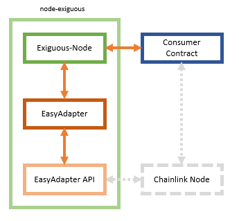
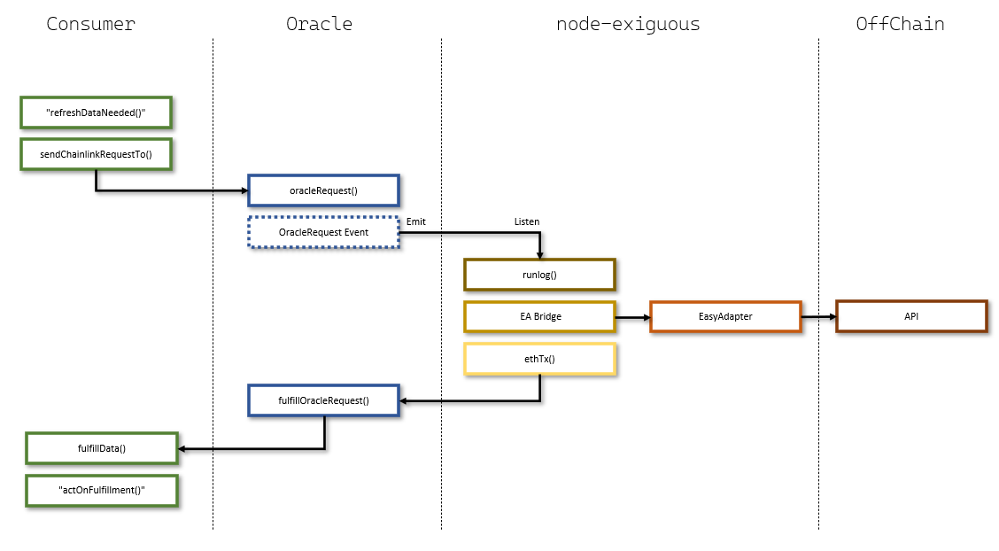

# node-exiguous
Exiguous [scanty; meager; small; slender; very small in size or amount]

Welcome to Exiguous & EasyAdapter.  

Exiguous is an experiment that aims to replicate a tiny subset of the Chainlink node request-response functionality through the use of node.js and web3. Think of Exiguous as steam-engine building kit toy; It will not be able to drive your production size cargo ship, but it visualizes how a motor works using real parts and principles. By creating your own oracle contracts and dissolve the coherence with the LINK token, you could theoretically prototype any chain-offchain request-reposonse flow, and implement your own payment scheme. 

Through integration with EasyAdapter, Exiguous offers multi-API response with complete byte-by-byte modelling of your bytes32 (return and concat many API responses into one return value), a pico-sized comparative binary trustaggregator and a code-less, datadriven, json-configurable adapter proxy engine. Additionally, EasyAdapter can seamlessly use the output of one API as input to another API using two priority levels, and all in one single flow !  

Example Scenario: You call the EasyAdapter URL for a matchresult, and provide parameter matchid = 123. In priority 1 flow, EasyAdapter calls the sports api to get the match result, but automatically also extracts the location and time of the match and store them in the flowbuffer. In priority 2 flow, EasyAdapter then applies the location/time parameters from the buffer to a second call to a separate weather API, to get the temperature of the day and time the match was played. Finally everything is concatenated into a bytes32 or string and returned to the node in one go. One EasyAdapter call, n API calls, one reply. All in milliseconds + any dataprovider latency, and completely code-less, all is done in json. You can find this scenario implemented in the 05_basket_combo_string adapter, look for the $fStore key. 

System is currently in alpha and the first version has no UI, no logging, no database and horrible error reporting, and will not scale to any reasonable load. Any production use is strongly discouraged. 

The node-exiguous repo consists of two parts, the Exiguous node and EasyAdapter. EasyAdapter is a json-configurable multi-response adapter that is both called internally by Exiguous, as well as exposed on an EA endpoint that can be connected in a Bridge config in the standard Chainlink node, so you can use Exiguous as a shell for EasyAdapter to just function as a standard external adapter.  

EasyAdapter is distributed together with node-exiguous, and can be found in the repo as /lib/easyadapter.js and used in other applications, for example an AWS lambda environment. 

 

## Exiguous vs. Chainlink node  
Exiguous do not have jobs (one Exiguous process is one "job" with a fixed, built-in task flow) - or tasks, like a full Chainlink node, and currently only supports a simple non-modular implementation of a pipeline v1 equivalent [runLog] -> [httPost] -> [converter] -> [ethTx] flow. It does however adhere fully to Chainlink conventions and request/response pattern, and will work out of the box with standard Chainlink Oracle- and Consumer Contract examples. Just point your oracle to your Exiguous wallet and off you go.  

Where Chainlink node is a all-on-one solution that will meet every imaginable scenario, Exiguous is narrowly focused on one single usecase as well as education and hobby-level node-building, and ultimately gradually explore how slim it is possible to model a complete Chainlink equivalent solution. 

At the time of this writing, one Exiguous process can only listen to one oracle address, and Exiguous cannot listen for specific topics.  

Exiguous-node jobs only have two keys, - "adapterid" and "hex". Adapterid tells Exiguous which adapter configuration it should use to get data when it recieves a jobid of the object key, for example a0000000000000000000000000000122 in the log. This is similar to setting the Bridge URL in a Chainlink job. The "hex" key tells Exiguous how to attempt to format the bytes32 response (raw bytes32 or string representation) which is kind of the same reponsibility that are catered for by the Chainlink node ethBytes32 and similar conversion core tasks. 

## Exiguous Setup

### tl;dr
clone repo  
npm install  
configure stuff  
node server  

### Running the scenarios

We will get the system up and running in two steps. You need to install postman as well as be comfortable with http basic principles, know how Chainlink functions, and optimally you would have already have experience with deploying solidity contracts through Remix or local frameworks like truffle. First you will get everything working through the EA API endpoint using postman, and then you will deploy a smart contract that will request and receive data from the Exiguous node. 

If you wish to run the provided examples to get aquainted with Exiguous, you need to gather and configure a few things. First you will need to aquire API keys for the dataproviders used in the examples and setup these keys in the adapter templates, and secondly you will need to aquire an API key for a full node provider that have a wss endpoint for your chain of choice (everything in this repo assumes rinkeby) - and finally you will setup your node wallet. Please refer to the sections "External Accounts Setup" and "Wallet Setup" towards the bottom of this file. 

HTTP
----
Lets start with getting some data through postman. Please refer to the section "Included Templates" in the bottom of this file; we will use the first one for the example, 01_basket_simple_hex. You will already be aquainted with the file from when you updated the API keys in the \json.adapters folder. From the specification you can see that the adapter accepts two parameters, "spec" and "id1". We will get back to what these mean later, but for now just also make note of the returned dataformat (OUT) which in this case is a string representation of a hexadecimal value. The return value represents the hexadecimal representation of the id of the winner of the basketball match id that was provided in "id1", according to basket-api on RapidAPI.com. 
  
Startup the system by entering >node server into a commmandprompt, and you should see a number of status messages starting with "Exiguous> init:please wait..."
  
Now open postman, create a new request, set method = POST,  Url = http://localhost:1234/easyadapter/01_basket_simple_hex. Then click Body, set format to json and enter: {"data": {"spec": "g2_spec", "id1":"127440"}} into the body of the request. The body format is the same format of the body that would be forwarded from an official Chainlink node, when using a Bridge configuration, so you can seamlessly connect an official Chainlink node bridge to the Exiguous api ! 

Click [Send] and you should see a result containing the "data" key containing a 32 byte hex value. 

Solidity
--------
To facilitate demonstration of the complete business flow, a solidity contract is provided for your convenience. This contract uses the exact same logic as a standard Chainlink consumer demo contract which you should be familiar with before continuing. There are MANY different means of getting the contract on-chain, and this is a bit beyond the scope of this document, so you will need to make your own choices and research, but the contract imports are configured for a Remix deployment, and you will have to change those to truffle or similar compatible import structure. 

It should be noted that for testing you would deploy the contract and then call either requestDataBytes32() or requestDataString(), inserting the parameter values (spec and id1-id6) that reflect the specification of the adapter you have chosen for your test (see bottom of mail). If in Remix, make sure you are on the right environment (Injected Web3) and not default VM. Click Transact and wait until confirmation, and then (click the blue button in Remix = ) call either dataObjectBytes32 or dataObjectString variables to see the returned resuilt.

#### Checklist

--Make sure you have deployed your Chainlink Oracle contract (get it from chainlink git repo, Oracle.sol version 6)  
--Make sure you have injected the node wallet address ("adr" in \json.wallet\wallet.ea.json) into the oracle fulfillment permissions  
--Make sure you have deployed the ExiguousClient.sol  
--Make sure you have hardcoded or injected the correct Oracle contract address into the Exiguous Client contract  
--Make sure you have hardcoded or injected the correct jobid into the Exiguous Client contract  
--Make sure you have set the correct chainid and setPublicChainLinkToken() call in the constructor in the Exiguous Client contract if you do not use Rinkeby  
--Make sure you have funded the Exiguous Client contract with testnet-LINK    
--Make sure you have funded the Exiguous node wallet address with testnet-ETH  

### Jobs Elaboration (\json.jobs files)
While the concept of jobs are not directly comparable with CL node jobs, a minimum configuration of jobs are needed to run the examples. In order to maintain full compatibility with Chainlink documentation and consumer contract templates, the "jobid" paradigm has been retained, but in Exiguous, it does not apply to configuration of the job flow (which is fixed runLog->httpPost->convert->ethTx) but only to the link between an adapter and a jobid. Open \json.jobs\jobs.json and you will see two very simple json objects with just one key and two properties, "adapterid" and "hex".

- The key itself "a0000000000000000000000000000122" is the jobid you supply in the call to CreateChainlinkRequest() in the consumer contract. In the example contract, ExiguousConsumer.sol, the jobid is stored in the contract, as opposed to being sent to the function each time, but the latter is an option. 

- The property "adapterid" can be compared to the "bridge task" name in a Pipeline V1 job, and refers directly to a file in the \json.adapters folder, only with the ea.json extention omitted. Job "a0000000000000000000000000000122" currently points to the "basketweather0" adapter = \json.adapters\basketweather0.ea.json.

- The "hex" property is a property that helps Exiguous format the output from EasyAdapter into the final format sent to the solidity contract.  

If you set hex=true, you can process 64 characters of output from the adapter, which will be stripped of "0x" and formatted and buffered into a 32bytes structure, but the data will have to be a hexadecimal representation to begin with. Note for demo: When "hex" = true, you should call the requestDataBytes32() solidity function, which will fullfill with fulfillDataRequestBytes32() and store the value directly into the "dataObjectsBytes32" variable, from where it can be retrieved after the transaction completes. 

However, if you set hex=false, the output from the adapter will be construed as a string, and you can then only process 32 charaters from your adapter. The EasyAdapter output will still be formatted into a bytes32, but now it will be of a string representation, not a hexadecimal representation (of, possibly (a number of) integers). NOTE for demo: With "hex" = false, you should call the requestDataString() solidity function, which will fullfill with fulfillDataRequestString() and *convert the bytes32 to string* before storing it in the "dataObjectsString" variable. 

### Repo folders
Exiguous root has a few other folders & files to have a peek at:  

\contracts: Solidity consumer example. Just the one for now.  
\json.abi : ABI's for full contracts, functions or events  
\json.adapters: The folder for adapter specifications that we visited earlier. Can contain sensitive info (API keys). Be careful to gitignore any files with your own API keys when forking and comitting.   
\json.db: Exiguous uses a ultra-simple json one-file database for job flow maintenance (which currently is limited to keeping track of latest block to avoid backfill at every startup). Wildly inappropriate for any scaling or production use, but adequately apt for a noisefree demo without need for installing and maintaining relational databases.   
\json.jobs: The job specification we visited earlier  
\json.wallet: The nodes wallet. Contains your PK if demo successfully setup. Be extremely careful not to commit your private keys to github !  
\lib: "External" libraries. For now easyadapter.js and orzdb.js.   
\img: images for this documentation  
.\server.js: Exiguous runtime  

### EasyAdapter templates
While it is the most important part of the system, the configuration of complex EasyAdapter solutions can be demanding and is not yet adequately documented. The included demo files and the following brief introduction is what is currently provided, but improvement is on the list with high priority. 

An EasyAdapter file consists of four elements, one or more API connections, one or more Authenticators, one or more Transformers and one or more Specs. API connections contains connection information for an external (sports/weather/price) API, but never any credentials, and rarely parameters. Authenticators are attached to API's, and contain the headers, tokens or queryString parameters used to authenticate against an API if needed. Transformers are used to model outputs of API's and to store values in the flowbuffer for use in other API's input. API's, Authenticators and Transformers are self-contained objects, which are tied together using Specs.

Specs contain four elements that are used to configure an adapter: Authentication Mappings, Transformation Mappings, Output Mappings, Path Params and QueryString Params. Authentication mappings are used to link API's to authenticators, Transformation Mappings are used to link API's to transformers, Output Mappings are used to format the output of one or many API's into the final output of the adapter, and Path- and QueryParams are used to map the input of EasyAdapter to the input of each API connection in the Adapter. 

The last adapter in the list in the bottom of this mail, 08_etherscan_verify, demonstrates returning a deep object and not just a field, and if you choose to go this way, you would then pick the object apart in an actual Chainlink job using the jsonParse core adapter.

## Standard Chainlink Oracle-driven Request/Response  

-> Consumer: Need Data 
-> Consumer: sendChainlinkRequestTo()  
-> Oracle: Create OracleRequest Event   
-> Node: Pick up event, call API, call Oracle: fulFillOracleRequest()     
-> Oracle: Call consumer:fullfillment()    
-> Consumer: Act on Data  

## External Accounts Setup
All the examples in this repo uses RapidAPI endpoints. To successfully run the examples without modification, you need to create an account on RapidAPI and EtherScan and setup trial subscriptions for the following API's:

https://rapidapi.com/weatherapi/api/weatherapi-com  
https://rapidapi.com/api-sports/api/api-football  
https://rapidapi.com/api-sports/api/api-basketball  
https://etherscan.io/apis  

Additionally, you need to setup an account on a ETH full node provider. The example uses infura, but you can use any nodeprovider that provides a wss endpoint.

## Wallet Setup
The Exiguous wallet is directly comparable to the wallet used in the in the official CL node, and is used to pay gas and fees for the settlement callbacks to your consumer contract. Open \json.wallet\wallet.example.json and provide the following information:

- "wssurl": The URL to your wss ETH fullnode provider. For example "wss://rinkeby.infura.io/ws/v3/yourapikey"
- "oracleAddress": This is the address you would have put in the runLog task parameters in a real Chainlink node, and tells the node on which address it is supposed to listen for OracleRequest events. 
- "adr": This is the public key of your wallet payer address
- "pk": This is the private key of your wallet payer address. Never share your private key with anyone, and always take adequate measures to protect your wallet file in whichever environment the system is running. 

Get your address and private keys from Metamask or where you keep your testnet address list.   

When done editing the file, save it as \json.wallet\wallet.ea.json. 

## EasyAdapter Templates Setup
Exiguous is tightly integrated with EasyAdapter, and it is currently not possible to connect the micro-node to other External Adapters than the built-in EasyAdapter integration ( but you can connect real CL nodes to the Exiguous EasyAdapter endpoint and just use Exiguous for the API part !) A number of EasyAdapter templates has been provided for your convenience and introduction to the configuration of the system. 

Open the folder \json.adapters where you will find a number of *.example.json files. These templates represent everything EasyAdapter needs to know 
in order to connect to an API and transform the data to your need. Make a copy of every single file in this folder to the same folder, and rename the copies .ea.json, for example "basketweather0.ea.json", "basketweather1.ea.json" etc. Now open each file and locate the "authentications" section near the top of the file, and locate the key "headersauth". Now replace "xxxxx" in the x-rapid-api key with your RapidAPI key in each file you wish to test.

## Included Templates  
    
### 01_basket_simple_hex.ea.json   
API Keys needed: Basket-api  
Returns one hex value from one API  
  
IN: {"data": {"spec": "g2_spec", "id1":"126782"}}  
OUT: "0x0000000000000000000000000000000000000000000000000000000000000171"  

### 02_basket_simple_string.ea.json  
API Keys needed: Basket-api  
Returns one string field from one API  
  
IN: {"data": {"spec": "g2_spec", "id1":"126782"}}  
OUT: "Phoenix Mercury W"  

### 03_basket_combo_string.ea.json   
API Keys needed: Basket-api  
Returns two fields from one API, concatenated into one delimited string  
  
IN: {"data": {"spec": "g2_spec", "id1":"126782"}}  
OUT: "Phoenix Mercury W_USA"  
  
  
### 04_basket_combo_string.ea.json  
API Keys needed: Basket-api, weatherapi-com  
Returns two fields from one API, and one field from a second API.  
Concatenates into one 3-part fixed size, dot-padded string.   
Finds match results from basket-api and the weather of the day from weatherapi-com, using direct dual parameter mapping  
  
IN: {"data": {"spec": "g2_spec", "id1":"126782", "id2":"2021-08-28", "id3":"17", "id4":"Chile"}}  
OUT: ".............171.............USA............................12.8"  

### 05_basket_combo_string.ea.json  
API Keys needed: Basket-api, weatherapi-com  
Returns two fields from one API, and one field from a second API.  
Concatenates into one 3-part fixed size, dot-padded string.   
Finds match results from basket-api and the weather of the day from weatherapi-com, using priority-based api_output->api_input parameter mapping  

IN: {"data": {"spec": "g2_spec", "id1":"126782"}}  
OUT: ".....171.....USA............12.8"  
  
  
### 06_basket_advanced_hex.ea.json    
API Keys needed: Basket-api, weatherapi-com  
Returns four fields from one API.  
Concatenates into 4-part fixed size, 0-padded string. Refer to ExiguousClient.sol for how to unpack bytes32->4xbytes8  

IN: {"data": {"spec": "g2_spec", "id1":"126782"}}  
OUT: "data": "0x00000000013463c2000000000001f1ce000000000000056c0000000060d79550"  
  
  
### 07_basket_advanced_compare.ea.json   
API Keys needed: Basket-api  
Fetches results from two api's and compares them. Simulated with cloned API's with seperate ids  
Concatenates into 3-part fixed size, dot-padded string  
  
IN: {"data": {"spec": "g2_spec", "id1":"126782", "id2":"127438"}}  
OUT: "data": "....1388....1388............true"  
  
  
### 08_etherscan_verify.ea.json (verify-spec)   
API Keys needed: Etherscan  
Fetches contract verification status from Etherscan  
Returns "OK" or "NOTOK" as string  
  
IN: {"data": {"spec": "etherscan_verify", "id1":"0xBB9bc244D798123fDe783fCc1C72d3Bb8C189413"}}  
OUT "OK|NOTOK"  
  
  
### 08_etherscan_verify.ea.json (objectparse-spec)   
API Keys needed: Etherscan  
Fetches contract verification status from Etherscan  
Returns "response" key as full object  
  
IN: {"data": {"spec": "etherscan_object", "id1":"0xBB9bc244D798123fDe783fCc1C72d3Bb8C189413"}}  
OUT {...deepObject}  
  
/Jesper 20210828  
